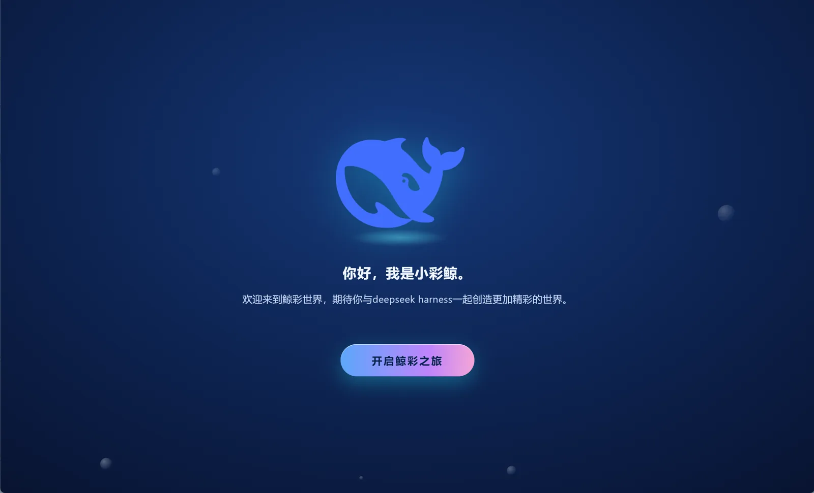
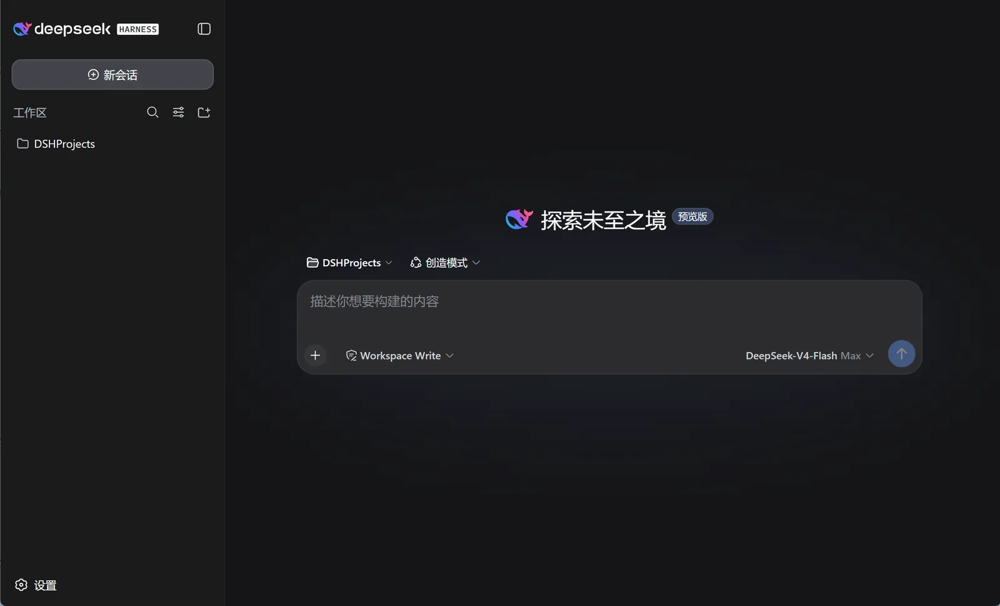
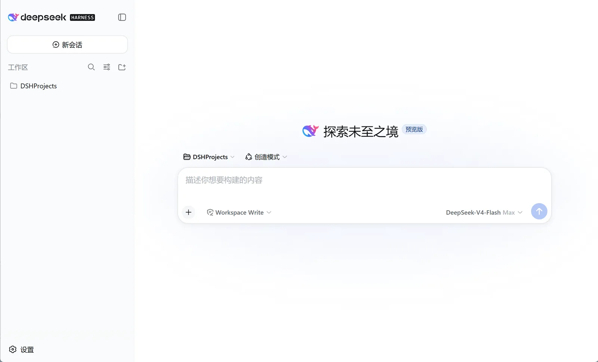
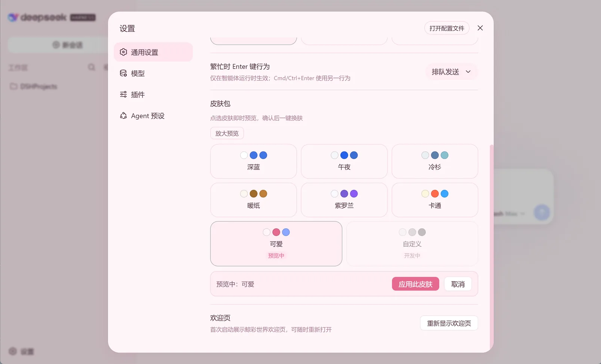

<p align="center">
  
</p>

<h1 align="center">鲸彩世界 DSHD · DeepSeek Harness Desktop</h1>

<p align="center">
  <b>为热爱探索的你而生 — DeepSeek Harness Desktop, for everyone.</b><br>
  基于 <a href="https://github.com/deepseek-ai/deepseek-harness">DeepSeek Harness</a> 的桌面发行版，内置 Node 运行时与 dsh，免安装、开箱即用。
</p>

<p align="center">
  <a href="#-下载">⬇ 下载</a> ·
  <a href="#-快速开始">🚀 快速开始</a> ·
  <a href="#-功能特性">✨ 功能特性</a> ·
  <a href="#-界面预览">🖼 界面预览</a> ·
  <a href="#-常见问题">❓ 常见问题</a> ·
  <a href="#-开发者">🛠 开发者</a> ·
  <a href="#-社区">💬 社区</a>
</p>

---

**English**: DSHD (DeepSeek Harness Desktop) is a desktop distribution of [DeepSeek Harness](https://github.com/deepseek-ai/deepseek-harness) with a bundled Node runtime and the `dsh` CLI — no Node.js or npm installation required. It ships with the *Whale Color World* welcome page and 7 built-in skins, keeps all your data local, and supports Windows & macOS. Free and open source.

## 🐳 项目简介

**鲸彩世界 DSHD** 是 DeepSeek Harness 的桌面发行版，把 Harness 的能力装进一个开箱即用的桌面应用：

- **免安装环境**：内置 Node 运行时与 dsh 程序，无需安装 Node.js / npm
- **小彩鲸品牌**：官方鲸鱼配色，鲸彩世界欢迎页
- **数据全本地**：会话、配置、插件都存于用户目录，程序目录只读不改
- **升级不丢数据**：用新版安装包覆盖安装即可，数据完整保留

## ✨ 功能特性

- 🐳 **鲸彩世界欢迎页**：小彩鲸动画 + 「开启鲸彩之旅」按钮，仅首次启动展示，可随时重新打开
- 🎨 **7 套内置皮肤**：午夜 / 冷杉 / 暖纸 / 紫罗兰 / 卡通 / 可爱 / 深蓝，点选实时预览、一键应用，另预留自定义槽位
- 🌗 **深色 / 浅色模式**：随系统或手动切换
- 🔒 **本地优先**：数据保存在 `%USERPROFILE%\.dsh`，程序目录只读
- 🖥 **Windows / macOS 双平台**：x64 / ARM64 全覆盖

## ⬇ 下载

安装包托管在 [GitHub Releases](https://github.com/weichi-ai/dshd/releases)：

| 平台 | 安装包 | 说明 |
|---|---|---|
| Windows | `DSHD-setup-win-x64.exe` | 安装向导，开始菜单/桌面快捷方式启动 |
| Windows | `鲸彩世界DSHD`（免安装版） | 解压即用，直接运行 `鲸彩世界DSHD.exe` |
| macOS | `鲸彩世界DSHD-arm64.zip` | Apple Silicon |
| macOS | `鲸彩世界DSHD-x64.zip` | Intel |

## 🚀 快速开始

1. 下载对应平台的安装包并安装
2. 启动应用，首次打开看到**鲸彩世界欢迎页**，点击「开启鲸彩之旅」进入主界面
3. 在设置中填写 API Key / 模型配置，开始探索

> macOS 未签名版本首次打开请 **右键 → 打开**，并执行一次：
> ```bash
> xattr -dr com.apple.quarantine /Applications/鲸彩世界DSHD.app
> ```

## 🖼 界面预览

| 欢迎页 | 主页 · 深色模式 |
|---|---|
|  |  |

| 主页 · 浅色模式 | 皮肤设置页 |
|---|---|
|  |  |

## ⚙️ 使用

- **欢迎页**：设置 → 通用 → 欢迎页 → 「重新显示欢迎页」
- **换肤**：设置 → 通用 → 皮肤包，7 套皮肤点选预览、确认应用
- **数据目录**：`%USERPROFILE%\.dsh`（会话、配置、插件）

## ❓ 常见问题

| 问题 | 解决 |
|---|---|
| 杀毒软件 / Defender 提示 | 程序未签名，加入白名单放行即可；正式分发将做代码签名 |
| 双击没反应 | 确认安装完整（查看 `resources\app\vendor\node` 与 `vendor\app` 是否存在） |
| 想用命令行 dsh | 在终端运行 `resources\app\vendor\node\node.exe resources\app\vendor\app\node_modules\@deepseek-ai\dsh\lib\bin.js` |
| 升级会丢数据吗 | 不会。程序目录只读，升级 = 覆盖安装，用户数据在 `%USERPROFILE%\.dsh` |

## 🛠 开发者

### 仓库结构

```
dshd/
├── dshd-package/   # Electron 打包工程（Windows / macOS 构建脚本）
├── dsh-welcome/    # 欢迎页插件（小彩鲸动画 + CTA）
├── dsh-skin-pack/  # 皮肤包插件（7 套内置皮肤 + 自定义槽位）
├── whale-logo/     # 品牌资源：小彩鲸 Logo 生成与前端补丁脚本
└── docs/          # 官网静态站（GitHub Pages 发布）
```

### 构建

```powershell
# Windows 安装包（产物在 dist\）
powershell -NoProfile -ExecutionPolicy Bypass -File dshd-package/build.ps1

# macOS 安装包（需要网络下载 darwin 版 Electron/Node）
powershell -NoProfile -ExecutionPolicy Bypass -File dshd-package/build-mac.ps1
```

### 品牌与插件

- 品牌补丁：`whale-logo/patch-frontend.js`（前端标题 / 图标 / 鲸鱼渐变）
- 插件源码：`dsh-skin-pack`（皮肤包）、`dsh-welcome`（欢迎页），均为 Cordis 插件，MIT 协议

## 📦 官网

官网（本仓库 `docs/` 目录）部署于 GitHub Pages：

<p align="center"><a href="https://weichi-ai.github.io/dshd/">🌐 weichi-ai.github.io/dshd</a></p>

## 💬 社区

| 渠道 | 方式 |
|---|---|
| QQ 交流群 | **929082451** |
| 微信群 | 请访问官网扫码加入 |
| 邮箱 | [2078580136@qq.com](mailto:2078580136@qq.com) |

## ⭐ 支持我们

如果这个项目对你有帮助，欢迎 **Star ⭐** 并分享给更多热爱探索的朋友，你的支持是我们持续前进的动力！

## 📄 License

[MIT](LICENSE) © 2026 weichi-ai
